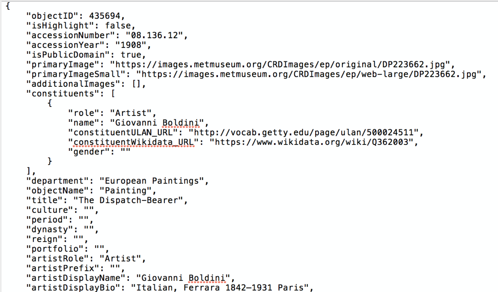
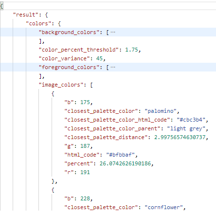
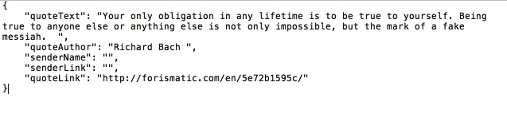
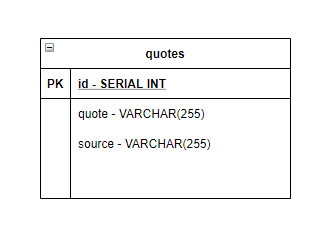
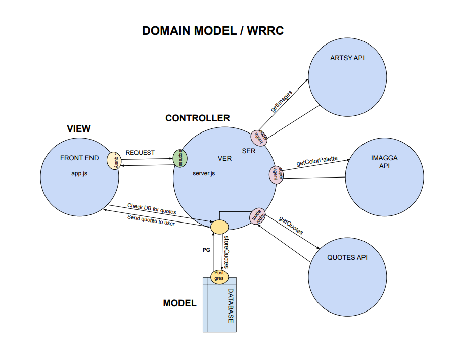
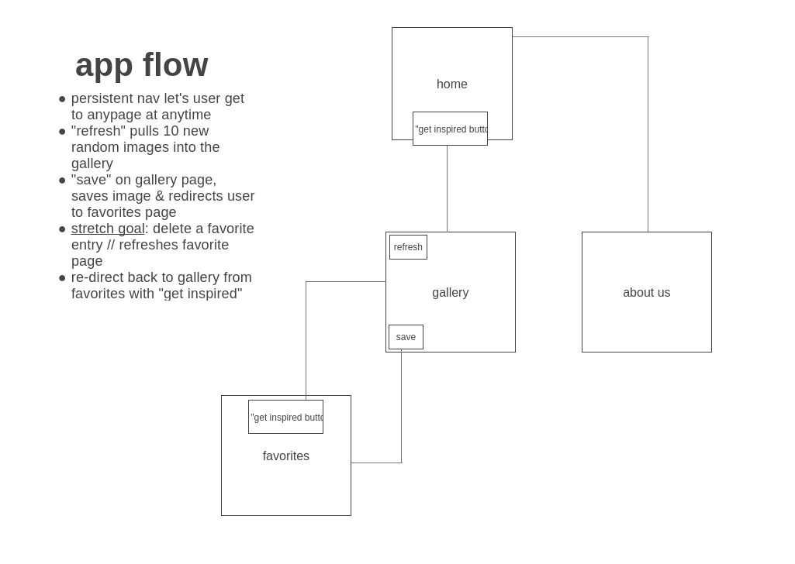
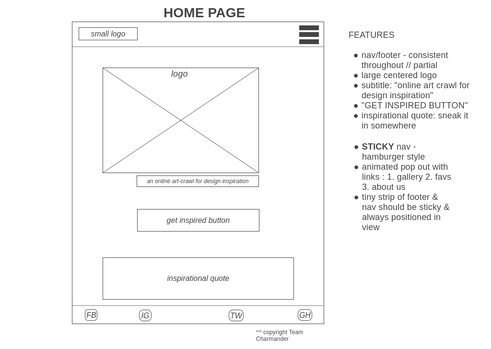
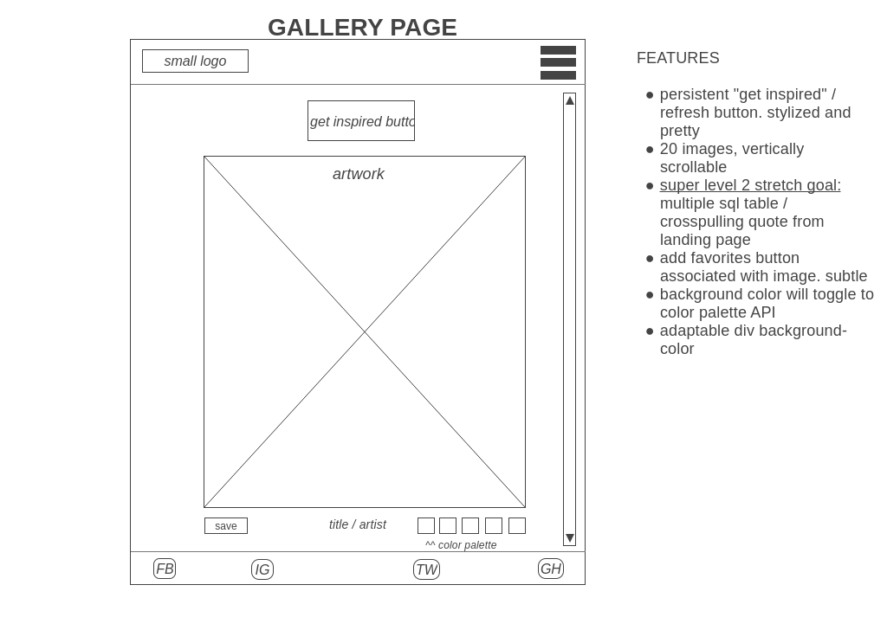
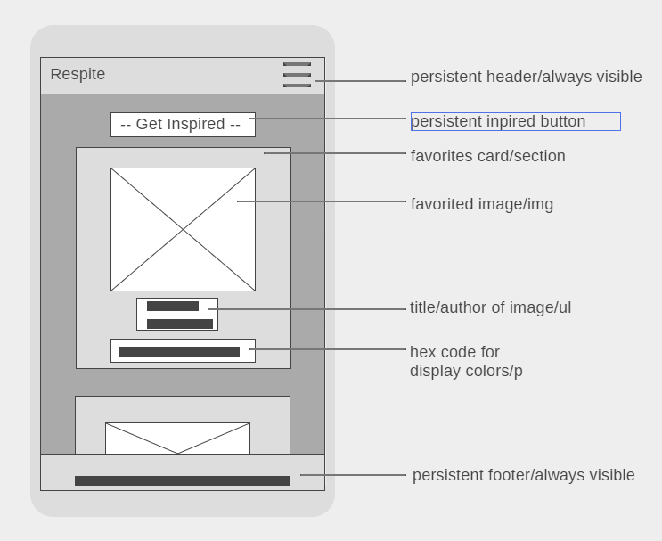
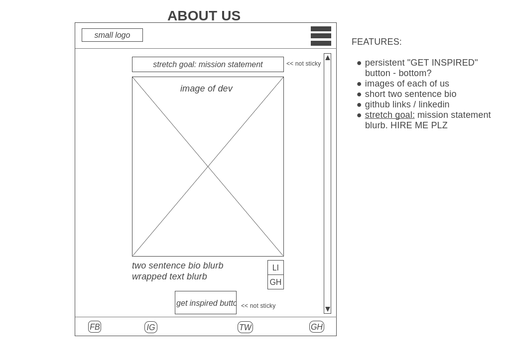

# Project: Respite

A virtual art-crawl for design inspiration  
**Version**: 3.10.2  
**Deployed URL**: https://respite.herokuapp.com/  

# Team Charmander Members 
Tif Taylor | [GitHub](https://github.com/tiftaylor) | [LinkedIn](https://www.linkedin.com/in/tiftaylor/)   
Chandler Puckett | [GitHub](https://github.com/chandlerpuckett) | [LinkedIn](https://www.linkedin.com/in/chandler-puckett/)   
Jack Nelson | [GitHub](https://github.com/jnelsonjava) | [LinkedIn](https://www.linkedin.com/in/jnelsonjava/)   

# Summary of Idea

We’re creating a Virtual Museum Experience for the user, an app that’s aesthetically pleasing and a welcome break from the stresses of daily life. The app will pull fine art exhibits from an art museum API (Artsy/Rijk/Unsplash to be decided) to display to the user. They will be able to swipe through paintings, photographs, and sculptures as if they were visiting the museum in person; a virtual walkthrough if you will. 
- The user will be presented with a color palette based on the images provided by the API, the color palette will be applied to the user’s “gallery”
- As a stretch goal the “gallery” will also play music for a complete audio/visual experience

### What problem does it solve?

Since we’re all stuck at home it provides a virtual escape from the mundane, and allows art enthusiasts, creatives, or anyone who just needs a break, to browse a virtual gallery of fine art exhibits from around the world. It is a welcome break from the doom-scrolling that can be found on typical social media apps. 

### MVP - Minimum Viable Product

- Site provides user with two color palette display options
- Site pulls images from art API to display to user
- Stores favorites images / palettes into database 

# Architecture
**Technology**: HTML, CSS, JavaScript     
**Libraries**: Node.js, jQuery  
**Framework**: Express   
**Packages**:  
  - "dotenv": "^8.2.0",
  - "ejs": "^3.1.5",
  - "express": "^4.17.1",
  - "method-override": "^3.0.0",
  - "pg": "^8.3.3",
  - "superagent": "^6.1.0"  
  
**API's Used**: 
  - [The Metropolitan Museum of Art Collection](https://metmuseum.github.io/)
    - GET: `https://collectionapi.metmuseum.org/public/collection/v1/objects/${objectId}`
    - Sample Response:
      - 
  - [Imagga](https://docs.imagga.com/)
    - GET: `https://api.imagga.com/v2/colors`
    - Sample Response:
      - 
  - [Forismatic](https://forismatic.com/en/api/)
    - GET: `http://api.forismatic.com/api/1.0/?method=getQuote&format=json&lang=en`
    - Sample Response:
      - 

# Database Schema
The schema.sql file contains a table called `faves` which contains data points from two different APIs   
APIs for table | [The Metropolitan Museum of Art Collection](https://metmuseum.github.io/) & [Imagga](https://docs.imagga.com/)

# Domain Model

# WIREFRAMES

# PM Tool

- [Asana](https://app.asana.com/0/1191260484271593/board)

# Credits / Resources
- Some of the hamburger specific CSS credit: [Erik Terwan](https://codepen.io/erikterwan/pen/EVzeRP). However, we did a lot of manual adjusting for our app use like removing his animation, adjusting positioning, padding/margin changes, colors, etc.
- For our social media icons, we used a free resource from [iconfinder.com](https://www.iconfinder.com/iconsets/miu-hexagon-shadow-social)

# Getting Started
- Create your own GitHub Repo and build out the base files seen in this repo such as the .env, .gitignore, etc.
- Create the Server, Database and Schema table
- Deploy the site somewhere, like Heroku
- Use the APIs listed in Architecture
- Used this [Google Font](https://fonts.google.com/specimen/Playfair+Display?query=playfai&sidebar.open=true&selection.family=Playfair+Display#license) by Claus Sorensen